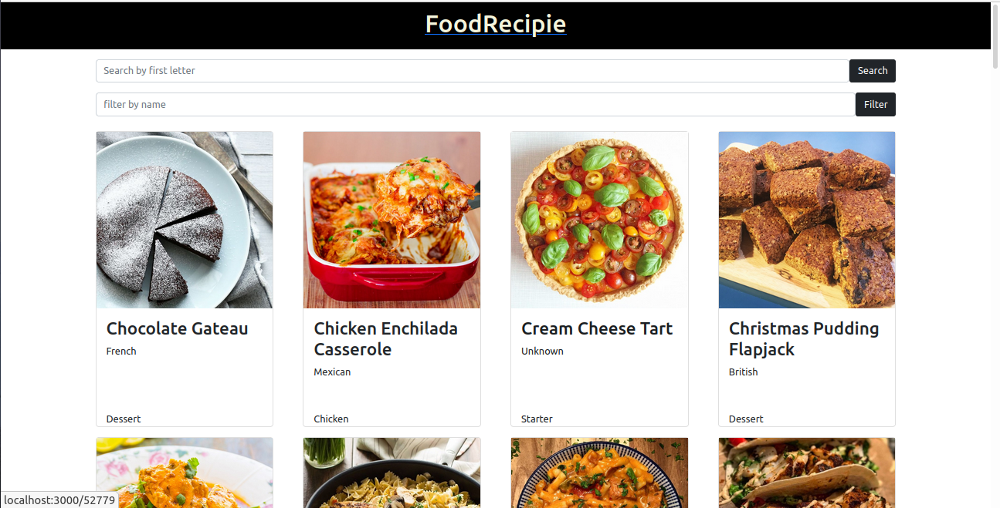

# Food Recipe(Catalogue of Recipes)
Food Recipe is a food search application where users can search for a list of foods by first letter and filter the list using food name.
## Screenshots of the app.

[Live Demo Link](https://60d9c0abccc45700086d7eec--epic-kilby-a23fc8.netlify.app/)

## Built With

- React

- Redux

- Bootstrap
 
- Css

## Prerequisities

node should be installed in your machine.

## Getting Started

**To get this project set up on your local machine, follow these simple steps:**

**Step 1** 
 - Clone the repo to your local machine.

 - cd inside the project directory.

**Step 2** 

 - npm install

 - run npm run start

## 🤝 contributing

## Author

- GitHub: [@arikarim](https://github.com/arikarim)
- LinkedIn: [AriKarim](https://www.linkedin.com/in/ari-karim-523bb81b3)

## 🙋‍♂ show your support

give a ⭐️ if you like this project!

## 📝 license

This project is [MIT](lisenced)